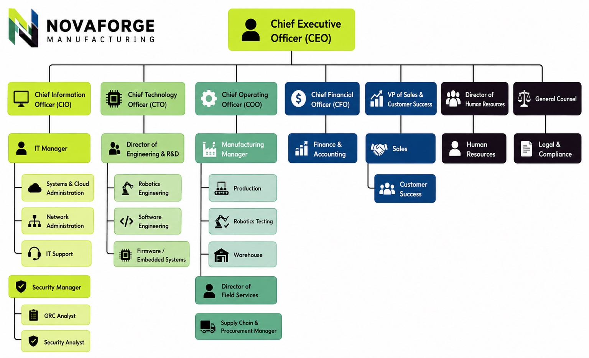

# NF-GRC-003 — Organizational Chart & Governance Structure

**Status:** Complete  
**Artifact Type:** Governance / Organizational Structure

## Artifact File

- [Open the full-resolution NF-GRC-003 Organizational Chart](./NF-GRC-003_NovaForge-Organizational-Chart.jpeg)



## Purpose

This artifact defines NovaForge Manufacturing's reporting relationships and establishes where IT, security, GRC, engineering, operations, and supporting business functions sit within the organization.

The structure is intended to support clear ownership of cybersecurity risk, security oversight, technical operations, and business accountability.

## Security & GRC Governance Structure

The organizational model places the security function under the Chief Information Officer (CIO), with a Security Manager overseeing both GRC and security analysis responsibilities.

```text
Chief Executive Officer (CEO)
│
├── Chief Information Officer (CIO)
│   │
│   ├── IT Manager
│   │   ├── Systems & Cloud Administration
│   │   ├── Network Administration
│   │   └── IT Support
│   │
│   └── Security Manager
│       ├── GRC Analyst
│       └── Security Analyst
│
├── Chief Technology Officer (CTO)
│   └── Director of Engineering & R&D
│       ├── Robotics Engineering
│       ├── Software Engineering
│       └── Firmware / Embedded Systems
│
└── Additional executive and business functions support manufacturing, operations, finance, human resources, legal/compliance, sales, customer success, field services, and supply chain activities.
```

## Governance Significance

This structure establishes several important GRC relationships:

- Executive leadership provides sponsorship and organizational oversight.
- The CIO serves as the GRC Program sponsor.
- The Security Manager provides security oversight.
- The GRC Analyst coordinates governance, risk, and compliance activities.
- IT teams support implementation and operation of technical controls.
- Engineering and business departments act as asset and risk owners where applicable.
- Legal & Compliance provides regulatory and contractual guidance.
- Department managers participate in risk ownership and remediation activities.

## Why This Artifact Matters

A GRC program requires defined accountability before risks and controls can be meaningfully assigned. The organizational chart provides the foundation for later work involving:

- Risk ownership
- Asset ownership
- Control ownership
- Policy approval
- Incident escalation
- Evidence requests
- Vendor accountability
- Remediation tracking

## Skills Demonstrated

This artifact demonstrates practical experience with:

- Governance structure design
- Roles and responsibilities
- Security reporting relationships
- Stakeholder mapping
- Risk ownership concepts
- Separation of governance and technical responsibilities
- Organizational context for security programs

## Next Dependency

The organizational structure supports **NF-GRC-004 — Asset Inventory**, where assets can be associated with departments, owners, business functions, and technical environments.

> NovaForge Manufacturing, Inc. is a fictional organization created for educational and portfolio purposes.
